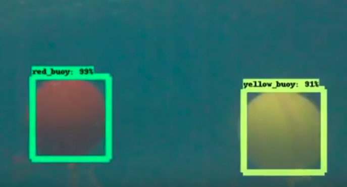

# AUV-Object-Detection
Uses CNN to detect objects.
Based on Tensorflow Object Detection API

**Currently based on :-**  
* [Single Shot Detector](https://arxiv.org/abs/1512.02325) for detection
* [Mobilenets](https://arxiv.org/pdf/1704.04861.pdf) for classification

To-Do: 
- [x] Red,Yellow Buoy underwater : 

- [ ] Validation Gate Detection
- [ ] Red Blue Bucket Detection 

Training data : 
* [Buoy](https://drive.google.com/open?id=1bRjmOAyn-A_BFh0TigXMeHBoEj1Pc2Ow)

Acknowledgements:
* [Tenssorflow Team](https://github.com/tensorflow/models/tree/master/research/object_detection)
* [Dat Tran's Medium Article](https://towardsdatascience.com/how-to-train-your-own-object-detector-with-tensorflows-object-detector-api-bec72ecfe1d9)
* [Sentdex's Python Programming.net](https://pythonprogramming.net/introduction-use-tensorflow-object-detection-api-tutorial/)
